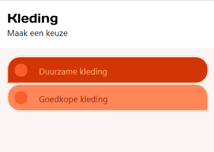
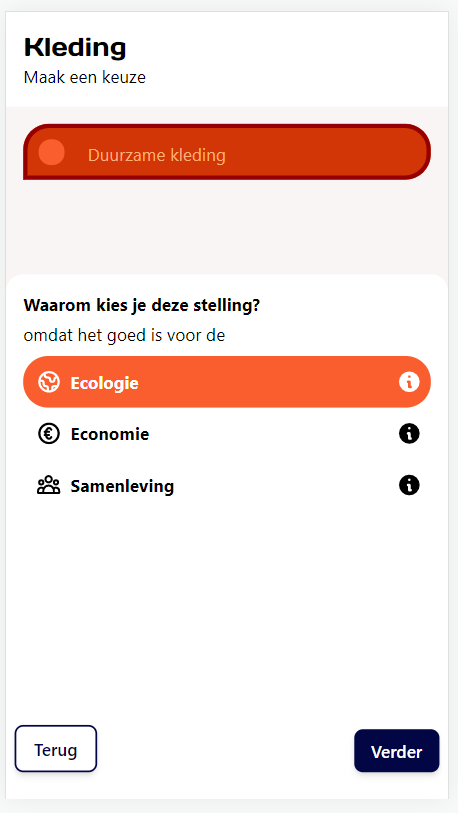
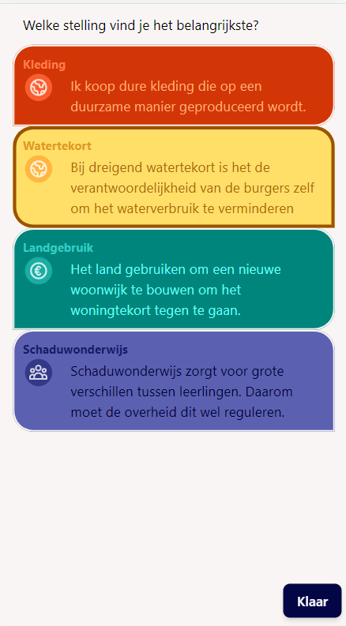
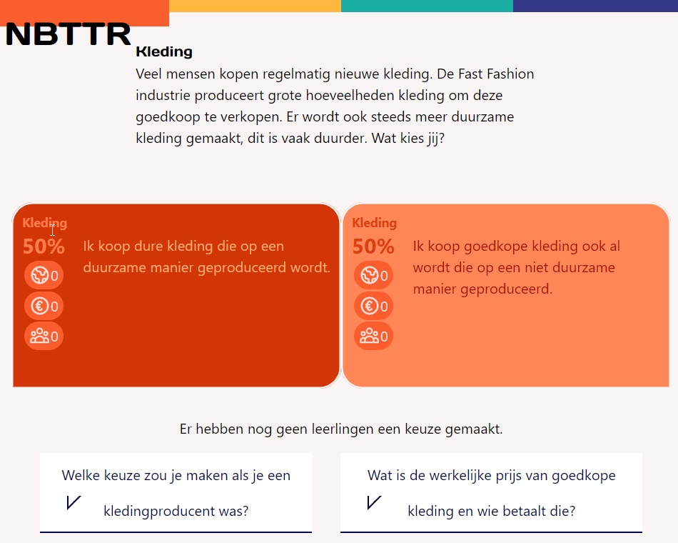

# KiesKleuring

KiesKleurig is created for civic education. It shows what is important for an individual student and how that is related to what other students find important.

The teacher starts an activity and leads students through four theses. The teacher controls when a next thesis can be viewed by a student. After the theses the student can select one of the chosen thesis as most important. The students get a summary of their own selection and how that relates to the different other selections of class mates.










# Techniques


The repository is created using <a href="https://nx.dev/">Nx</a> tooling. It contains two React applications: one for the student and one for the teacher and a functions app for firebase-function.

Authentication, storage and realtime updates come from firebase.

The ```firestore.rules``` makes sure that logged in users can only access their own created data. 

Read models for teachers are created and updated everytime the student data changes. That way the teacher doesn't have to query student data and gets realtime updates when watching the readmodel collection.

Unfortunaty the 'Blaze Pay as you go' firebase plan is needed to be able to deploy this functions. To try this example you probably won't be charged because of the free initial credits you'll have and by default is asks to set a budget (prefilled with 25$). But a credit card should be coupled.

Most components can be viewed and tested apart from the application using <a href="https://storybook.js.org/">Storybook</a>

# Static data

The theses are hard coded in ```libs\data\src\lib\themes.ts```